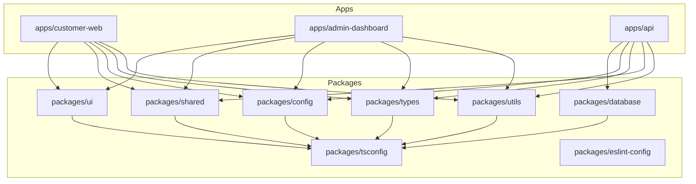

# Architectural Overview

This document describes the architectural patterns, security controls, and directory guidelines applied in the FortifyKitchen monorepo.

---

## 1. High-Level Core Design

The project uses **Turborepo** with **pnpm workspaces** to compile code in isolated packages. The layout avoids duplicate logic by centralizing UI component blocks, configurations, and data models in shared directories.



---

## 2. Backend Architecture: DDD Lite (NestJS)

The backend (`apps/api`) applies Domain-Driven Design Lite principles inside modular bounded contexts.

### Module Folders Checklist
Every module folder (e.g., `orders/`) must contain these specific subdirectories to enforce clean boundaries:
- `controller/`: Interacts with standard client requests. Handles Swagger definitions and runs route guards.
- `service/`: Houses core domain logic, computations, and workflow orchestrations.
- `repository/`: Executes database operations. Abstracts Prisma Client queries.
- `dto/`: Houses request schemas (`class-validator`) and response serializers.
- `entities/`: Models domain schemas.
- `interfaces/`: Defines port interfaces for mock repository injections.
- `validators/`: Custom business rule check routines.
- `mapper/`: Translates DB raw outputs to Domain entities and DTO response layers.
- `types/`: Internal typings.
- `constants/`: Module strings.
- `exceptions/`: Domain specific errors.
- `guards/`: Route parameters checks.

### Decoupling & DI Pattern
Services must never import raw database repositories directly. Instead, they interact via interfaces injected using injection tokens:
```typescript
constructor(
  @Inject(USERS_REPOSITORY_TOKEN)
  private readonly usersRepository: IUsersRepository
) {}
```

---

## 3. Frontend Architecture: Feature-First Organization (Next.js)

Applications like `customer-web` and `admin-dashboard` apply a feature-first approach. Feature domains (such as `orders/`) keep all resources cohesive:
```text
src/features/orders/
├── components/   # Feature specific UI (e.g. OrderCard, TrackOrder)
├── hooks/        # Queries and mutations (TanStack Query hooks)
├── services/     # Feature fetch operations
├── schemas/      # Input validation definitions (Zod schemas)
├── types/        # TypeScript entities
├── constants/    # Feature settings
└── utils/        # Internal helpers
```

- **Shared UI**: Global components (like `Button`, `Dialog`, `Table`) must always be imported from `@fortifykitchen/ui` to prevent visual duplicates.
- **State Management**: Asynchronous server caches are handled by **TanStack Query**. Core client-side configurations use React Context only when strictly necessary.

---

## 4. Security Controls & Cross-Cutting Concerns

- **Input Validations**: Verified at boundaries (Zod schemas on Next.js forms, `class-validator` DTOs on NestJS routes).
- **Environment Checks**: Checked at boot using Zod rules inside `@fortifykitchen/config`.
- **Global Pipes**: Custom pipes formats NestJS API returns uniformly:
  - Error: `{ success: false, message: string, errors: any[] }`
  - Success: `{ success: true, message: string, data: any }`
- **Security Middlewares**: Secure cookies, rate-limiting (`ThrottlerModule`), Cors origins, and Helmet headers are enabled by default.
